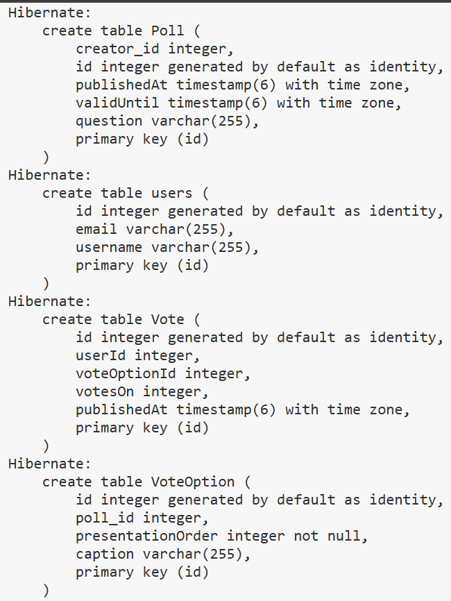

# 
 Dat250 lab 3 report
# 
 Isak Yau  

In this lab, I had to add JPA annotations so that this project had an object relational mapping amongst the different models.  
Starting off, there were some technical problems where the test file we were provided didn't find the *PersistenceConfiguration* import.  
I struggled finding out why the test file had this issue, until I found out through chatgpt that one of the dependencies was missing.  
The lab description provided us with dependencies, which I thought would be enough. 
However, one of them was missing which was the one used for *PersistenceConfiguration*.  
(Found out that this dependency was added into the lab description later on)

Other non-technical issues I encountered was that my implementation of my models where I manually set the objects Id would not work with the given tests.  
So I had to change my backend implementation in a way so that it would work for the tests when they created objects.  
Overall, it was tough debugging through the errors that were in the [PollsTest](backend/src/test/java/dat250/lab1/PollsTest.java).  
This was because the errors weren't very self-explanatory, and retracing them was messy.  
After a while, I noticed a pattern and slowly understood how to pattern match the diagnosis for why the errors occurred.  

Here is the link to the [PollsTest](backend/src/test/java/dat250/lab1/PollsTest.java).  

In order to inspect database tables and see what tables were created, I had to add some additional parameters to the 
*PersistenceConfiguration*.  
By adding *show_sql* set to true, the database tables and the SQL queries executed in the test would be displayed in the test result.  
Here are the tables that were created:  
  

Finally, to wrap this report up. I have no pending issues with this lab that I didn't manage to solve.  
